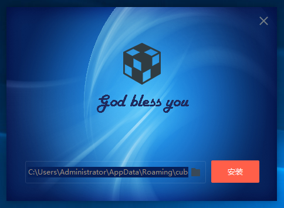
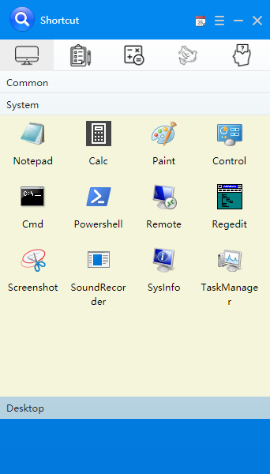
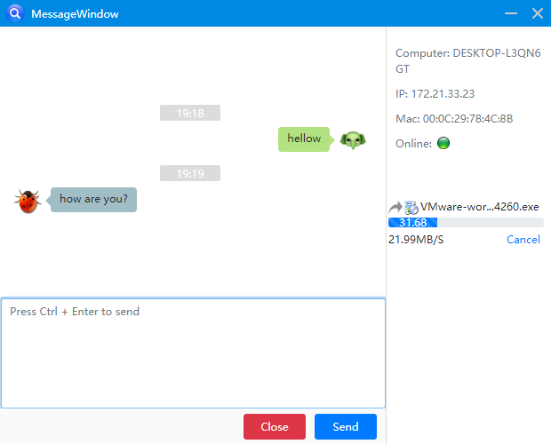

# cubez-web 
A product, based on cef, QT and native-c++, provide easy access to computer.
execute the readme/cubez.exe to install product, 
you can:
```
1、Drag and drop the program icon to start quickly
2、Record and operate clipboard history
3、Drag file to calculate fingerprint
4、High performance file transfer and message on LAN
5、Other convenience function
```







## Project setup
```
1、Install nvm from https://github.com/coreybutler/nvm-windows/releases
2、reboot
3、nvm install latest and alter node64.exe/node32.exe to node.exe, add the path env
```

### Compiles and hot-reloads for development
```
npm install -g @vue/cli
#vue init webpack myapp
npm install node-sass --save-dev
npm install sass-loader --save-dev
npm install --save @efox/websdk
npm install vue-router
npm install vue-meta
npm install vue-clipboard2
npm install --save v-tooltip
npm install --save spark-md5
```

### Compiles and minifies for production
```
npm run build
```

### Run your tests
```
npm run dev
```

### Lints and fixes files
```
npm run lint
```

### Customize configuration
See [Configuration Reference](https://cli.vuejs.org/config/).