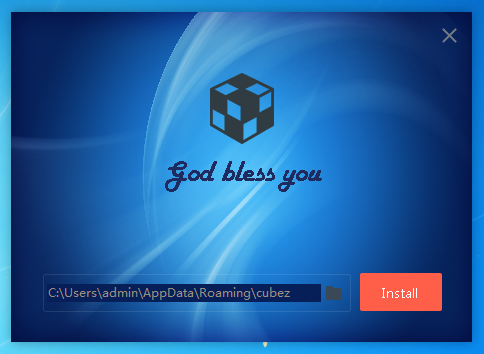
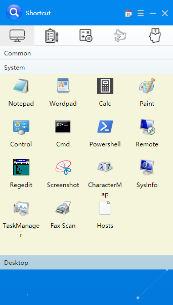
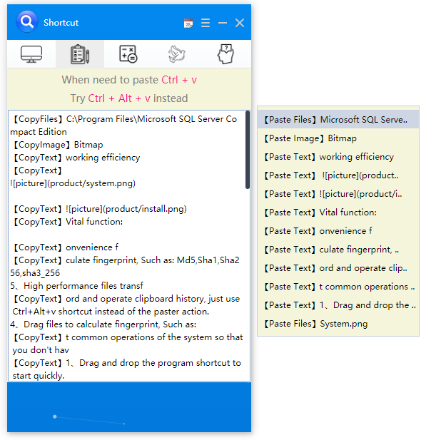
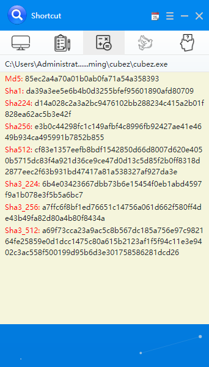
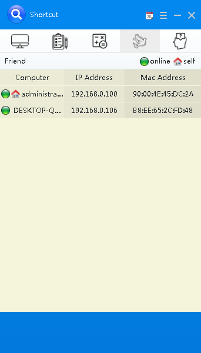
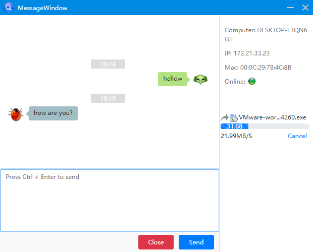

# cubezapp 
The cubezapp, based on cef, QT and native-c++, provide easy access to computer on Windows.
It can improve your working efficiency, especially for programmers. 
Download the product/cubez.exe to install the APP.
After started, it will automatically hide at the top of the screen,press F4 or mouse touch to call/hide mainpanel.
Vital function:
```
1、Drag and drop the program shortcut to start quickly.
2、Sort out common operations of the system so that you don't have to go back to the desktop when using the desktop shortcut.
3、Record and operate clipboard history, just use Ctrl+Alt+v shortcut instead of the paster action.
4、Drag files to calculate fingerprint, Such as: Md5,Sha1,Sha256,sha3_256
5、High performance files transfer and message on LAN, Support fro large files transfer.
6、Support Chinese and English instant switch.
7、Other convenience function
```













## Project setup
```
1、Install nvm from https://github.com/coreybutler/nvm-windows/releases
2、reboot
3、nvm install latest and alter node64.exe/node32.exe to node.exe, add the path env
```

### Compiles and hot-reloads for development
```
npm install -g @vue/cli
#vue init webpack myapp
npm install
```

### Compiles and minifies for production
```
npm run build
```

### Run your tests
```
npm run dev
```

### Lints and fixes files
```
npm run lint
```

### Customize configuration
See [Configuration Reference](https://cli.vuejs.org/config/).